# Match-Filtering on gravitational wave dataset

This project uses match-filtering for an idealized detection of gravitational waves emitted during the inspiral and merger of compact binary objects. The used data are synthetica nd were given as part of a university course.

## Files
- `AllWithNoise.dat`: Data file with the noise
- `template.ipynb`: Jupyter notebook explaining the template creating and match-filtering algorithm
- `match-filtering.py`: Python script with the match-filtering algorithm
- `meta-analysis.ipynb`: Jupyter notebook with the analysis of the data
- `results.pdf`: PDF file with the results of the analysis

## Usage

Run the `match-filtering.py` script to generate the results. The script will generate a `results` folder with the results of the analysis. The `meta-analysis.ipynb` notebook can be used to analyze the results.

## Result plots
### Strain 1:

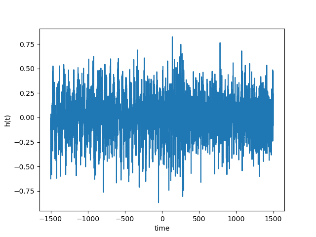
raw data 

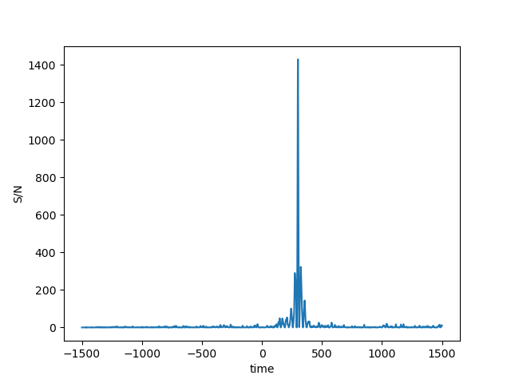
S/N - time

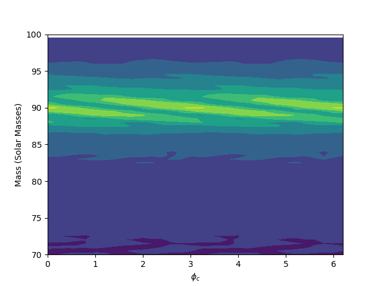
Mass - $\phi_c$ contour plot showing the S/N

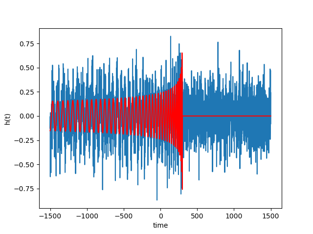
raw data overlaid with the detected wave

### Strain 2:

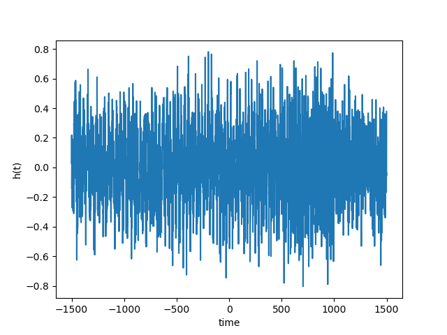
raw data

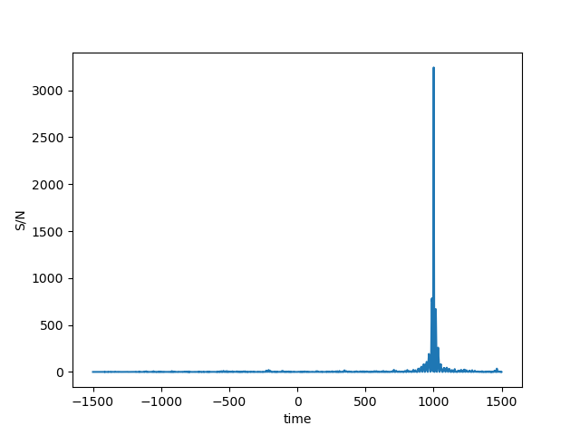
S/N - time

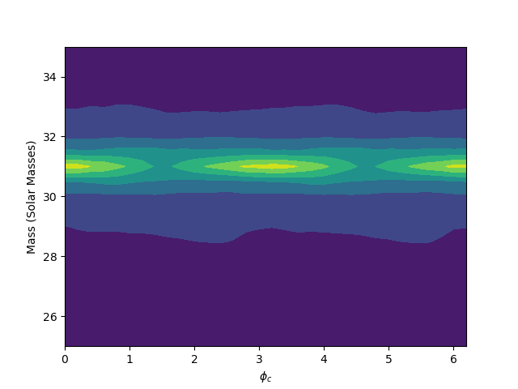
Mass - $\phi_c$ contour plot showing the S/N

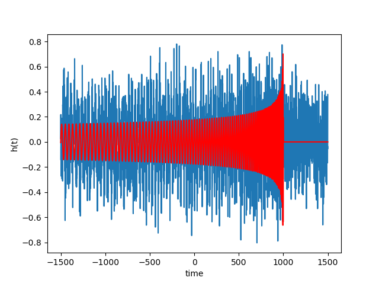
raw data overlaid with the detected wave

### Strain 3:

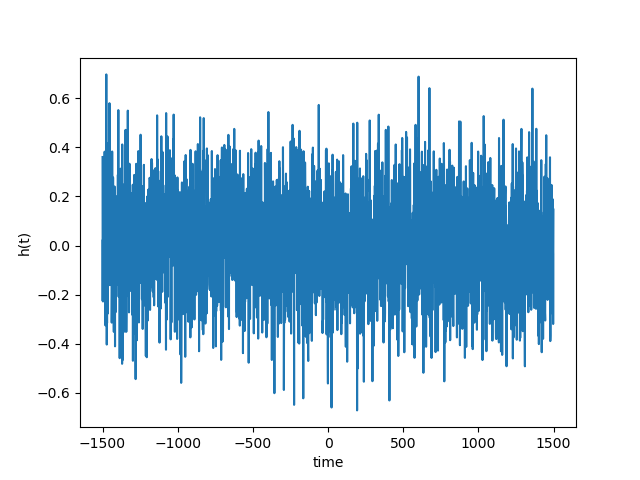
raw data

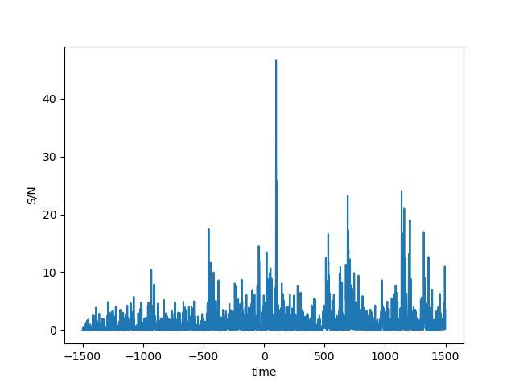
S/N - time

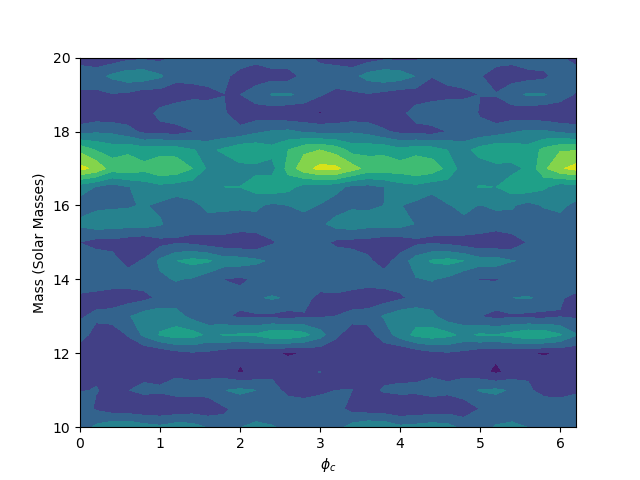
Mass - $\phi_c$ contour plot showing the S/N

No wave can be detected in this strain.